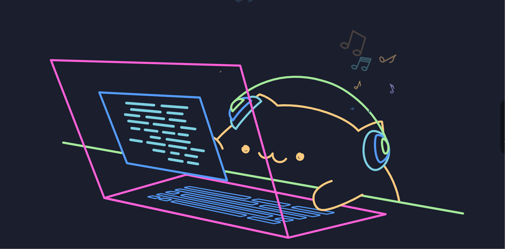

<!-- -->

¡Hola! Soy **Adolfo**, estudiante de Ingeniería en Sistemas apasionado por el desarrollo de software y la tecnología.

Este repositorio sirve como mi CV interactivo, donde puedes explorar algunos de mis proyectos, habilidades, experiencias en áreas como **Frontend**, **Bases de Datos**,
**Lenguajes de Programación**. 

Actualmente, me encuentro en proceso de aprendizaje en estas tecnologías, lo que me motiva a seguir creciendo y mejorando en el campo de la ingeniería en sistemas y la tecnología.

 

## Mis Redes

[]
 

## 🎯 Sobre Mí

Actualmente estoy cursando mi carrera en **Ingeniería en Sistemas** y me gusta explorar nuevas tecnologías orientadas al desarrollo web, ya sea de front o backend y lenguajes de programación, así como aprender constantemente sobre el mundo del desarrollo de software y seguir mejorando mis habilidades.

- 🎓 **Carrera**: Ingeniería en Sistemas
- 🖥 **Intereses**: Desarrollo Web, Backend, Arquitecturas de Software y otras tecnologías.
- 🌱 **Aprendiendo**: HTML, CSS, C++, Python, Base de Datos.
- 📫 **Contáctame**: [Correo]()
- ⚡ **Dato curioso**: La música es mi compañera de trabajo; me ayuda a crear un ambiente productivo y creativo.
## 🛠 Tecnología & Herramientas 

### Lenguajes💻
 

<!--<
> -->

 

### Frontend Development:
 

 

### Control de Versiones y Herramientas:
 

&nbsp;

 

## 📚 Educación

- **Ingeniería en Sistemas** [Universidad Nacional José María Arguedas](http://www.unajma.edu.pe/)
- **Cursos y Certificaciones**: 
  - Curso Programación Frontend [Alura Latam](https://www.aluracursos.com/)

## 🌱 Objetivos

- Mejorar mis habilidades en **Backend** y **Frontend** y en otras áreas de la carrera.
- Contribuir a proyectos de código abierto.
- Aprender más sobre **arquitectura de software**.
- Aprender sobre **redes computacionales**.

## 🔗 Encuéntrame en:

- [GitHub](https://github.com/AdolfoLayme)
- [LinkedIn](https://www.linkedin.com/)
- [Correo]()
 

"Gracias por visitar mi perfil. ¡Espero que te haya encantado! Si tienes alguna pregunta o quieres conectar, no dudes en contactarme. 👋🤍"
